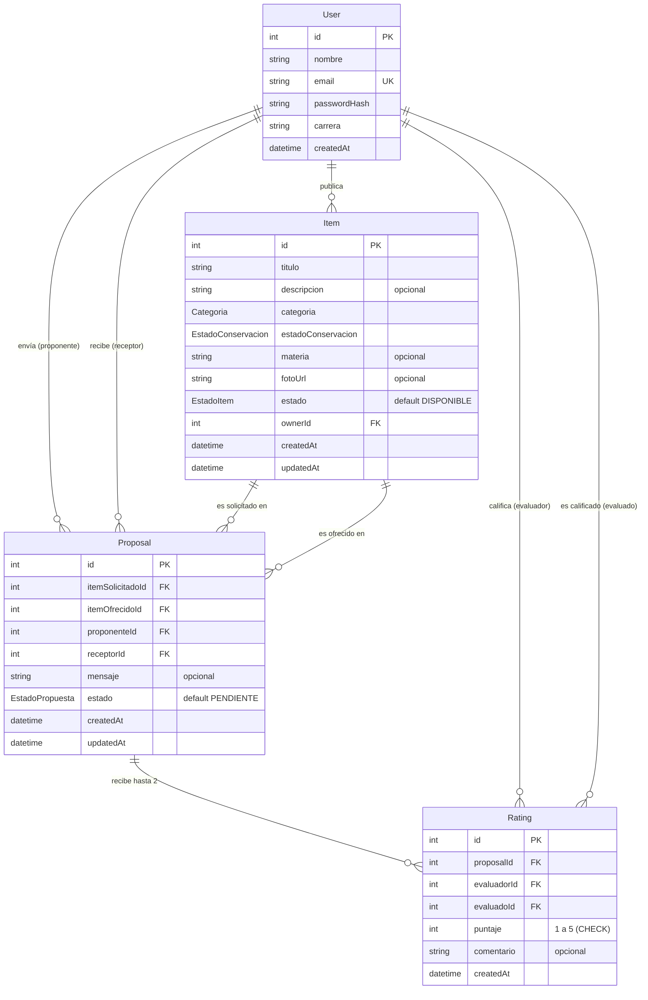

# Diagrama entidad-relación — TruequeUTN

Modelo de datos inicial (TEC-02). La fuente de verdad es [`server/prisma/schema.prisma`](../server/prisma/schema.prisma); si cambia el schema, actualizar este diagrama en el mismo PR.

GitHub renderiza el diagrama automáticamente. En VS Code se puede ver con la extensión _Markdown Preview Mermaid Support_.

## Enums

| Enum                 | Valores                                               |
| -------------------- | ----------------------------------------------------- |
| `Categoria`          | LIBRO, APUNTE, CALCULADORA, INSTRUMENTAL, OTRO        |
| `EstadoConservacion` | NUEVO, BUENO, USADO                                   |
| `EstadoItem`         | DISPONIBLE, RESERVADO, INTERCAMBIADO, PAUSADO         |
| `EstadoPropuesta`    | PENDIENTE, ACEPTADA, RECHAZADA, CANCELADA, CONCRETADA |

## Restricciones relevantes

- `User.email` es único.
- `Rating` es único por (`proposalId`, `evaluadorId`): cada participante califica una sola vez por intercambio.
- `Rating.puntaje` tiene un `CHECK` entre 1 y 5, agregado a mano en la migración inicial porque Prisma no lo soporta en el schema.
- Todas las claves foráneas usan `ON DELETE RESTRICT`: no se puede borrar un usuario o ítem que tenga propuestas o calificaciones asociadas (por eso HU-15 plantea borrado lógico).
